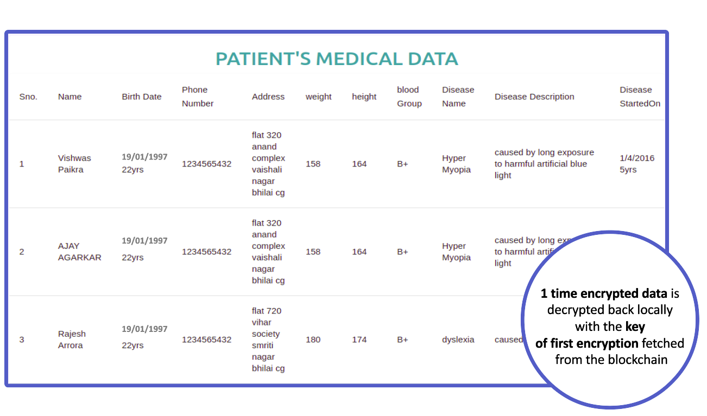

### watch the Project Demo by clicking on the below video
[
### Install the  following applications in your system
 1. Ganache
 2. Metamak (chrome extension)
### Deploy the contracts in the blockchain network
1. Open Ganache and select quick start
1. Make sure you have truffle installed
2. Use the link to install truffle https://www.npmjs.com/package/truffle
3. Once installed use code > [truffle deploy] .. in the terminal.
4. The address in the contract present in `build/contracts/_.js` will change
5. Copy the address of each contracts and paste it in the `src/contracts/_.js  PATIENT_DATA_LIST_ADDRESS`
### create account in metamask
1. copy one of the private key present in Ganache app
2. Import the private key in the metamask to create account
3. change `not connected` to `connected` 

### To run the project
`npm update` then `npm start` And now you can start saving the patient data.
### Idea behind this project

Blockchain based Database to secure patient data and ensure privacy

# INTRODUCTION

From the past 2 years the world is enduring with Coronavirus. In these 2 years we can see a significant number of individuals in universities or workplaces or any working environment submitting counterfeit Coronavirus reports and other health records inorder to get some benefits. There is no straightforwardness and security to the health records. so inorder to beat this large number of issues we want to give the upgraded security to the health records.

So we developed a prototype system to implement our concept and tested its performance . The outcomes showed the way that our prototype can be utilized by doctors to verify patient's consent. Patients likewise can receive their previous records from different clinics where the data is stored transparently and immutably in ledger where no one can change the stored data in the ledger. This provides a better security to the health records.

So after seeing the results of our prototype we are prepared to implement the dapp utilizing blockchain technology.

# COMPONENTS

`2.1 what it does`

Medical care data is fundamental piece of everyday life. The vast majority of miscommunication in the medical services area happens because of altering clinical records by unauthorized peoples that prompts absence of integrity. So Blockchain technology can assist in the health care solutions with caring arrangements and can give security to the records where the Clinical exchange history put away in a distributed ledger to achieve the transparency among the patient , doctor, clinic, drug store and laboratory. Using the blockchain in the project Automates verification of medical adherence and ensures patient data integrity and provenance.

our application provides the ultimate transparency and revolutionizes the field of healthcare, keeping the transaction records and medical history in see-through , shared databases, where they are protected from deletion and modification. Also, It adequate the patients care and health facilities and furthermore it is utilized for the data gathering structure from different system which can help the doctor. The main purpose to use the blockchain in our applications is the list of transactions or records that are stored in the form of a block that cannot be edited once they are validated by the nodes.

`2.1 How we build`
Ethereum's smart contracts: We utilize Ethereum's smart contracts to construct the contracts to contain metadata about the record ownership and the permissions on the particular record and data integrity. The blockchain transactions in our framework convey cryptographically marked guidelines to deal with these properties. we also trying to store the intelligent representations of existing medical records within individual nodes on the network using Ethereum's smart contracts.

Dapp: we are using Dapp(decentralized app) that stores its source code on a decentralized peer-to-peer network. This implies that allowing users to interact directly with one another which reduces the chances of error and fraud by making the platform’s source code and transactions available to the public. The main purpose to choose the dapp for implementation of our application is to Enhanced the Security.

`2.2.1 Smart Contracts` 

A smart contract is a computer program or a transactional Protocol which is intended to automatically execute, control or document legally relevant events and actions according to the terms of a contract or an agreement.​ The objectives of smart contracts are the reduction of need in trusted intermediators, arbitrations and enforcement costs, fraud losses, as well as the reduction of malicious and accidental exceptions.​ 

# Working

Three components take part in the encryption, hashing and storage process and they are  Client, Blockchain and the Third party system. 

`3.1 To store the encrypted data in the blockchain we follow the steps given below`

- The client first creates a key using the data as key-text for the SHA-256 cryptographic hashing function. Now the generated key is used to encrypt the data locally using the AES encryption algorithm. 

- Now the encrypted data is sent to the Third Party System where the encrypted data is again encrypted using the steps followed in step-1 i.e the encrypted data is used as key-text for SHA-256 which generates a key and this generated key is used to encrypt the locally encrypted data. The key generated is stored in the database of the server with the id of the owner of the data. 

- Now the encrypted data from the Third Party System is sent back to Client which sends this encrypted data from the Third Party System along with the locally generated key to the blockchain. The blockchain then writes this transaction in the block and stores the data in its database. Which means that every node connected to this blockchain network has this new encrypted data which is immutable. 

`3.2 To fetch encrypted data from the blockchain  we follow the steps given below`

- The encrypted data and the locally generated key stored in blockchain is fetched 

- The encrypted data is then sent to Third Party System where it decrypts the data using the key stored in it’s database with user ID and we get the locally encrypted data but only if there is a permission by the owner of the data to share it with the owner of the request sent from the client. This decrypted data is then sent to the client. 

- The decrypted data from the Third Party System is then decrypted to original data using the key fetched from the blockchain. And we get the original data to show it to the world.

Figure 2: Figure showing transmission of data between the Client and the Third Party System

# What we learned

Blockchain Technology can possibly change medical services, setting the patient at the focal point of the medical care biological system and expanding the security, protection, and interoperability of information. This innovation could give another model to health information exchanges (HIE) by making electronic clinical records more proficient, disintermediated, and secure. While it's anything but a panacea, this new, quickly developing field gives ripe ground to trial and error, speculation, and confirmation of-idea testing.

we also learned how to involve the DApp application in various web applications .WE additionally educated the cycle that are going in the medical services framework right now.

# What's next for SECURE HEALTH

Our next stage is to develop our application to a higher level in the medical services area so that it will make lives of individuals more gorgeous with out the stresses over there wellbeing. we also try to implement the backend api library which manages the Recorded health records and their interfaces. which can avoid the hurdles of working directly with the blockchain.

Figure 3: An image showing locally decrypted data retrieved from the blockchain in encrypted form.

